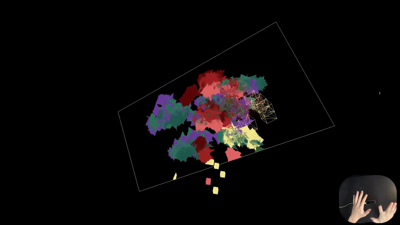

# Voxel Fantasy

## Description

Voxel Fantasy is a web-based interactive experience powered by Leap Motion and three.js.

Manipulate the canvas using your left hand and paint with your right hand. The paint drops will stick to your finger joints with different colors from several color palettes, until you dip or splash them onto the canvas.

The project was done in collaboration with [Wenhe Li](https://github.com/WenheLI) in Spring 2018, under the course **Kinetic Interfaces** taught by [Jung Hyun Moon](http://moqn.net/).

-> [Demo Video](https://www.youtube.com/watch?v=CoZa4juJYbQ)

## Notes

This repo is a reupload from the [orginal develop repo](https://github.com/WenheLI/PixelFantasy).

## Quick Access

First plug in a Leap Motion into your device, and then hit -> [Link](https://pixel-fantasy.vercel.app/) (hosted on [Vercel](https://vercel.com)).

